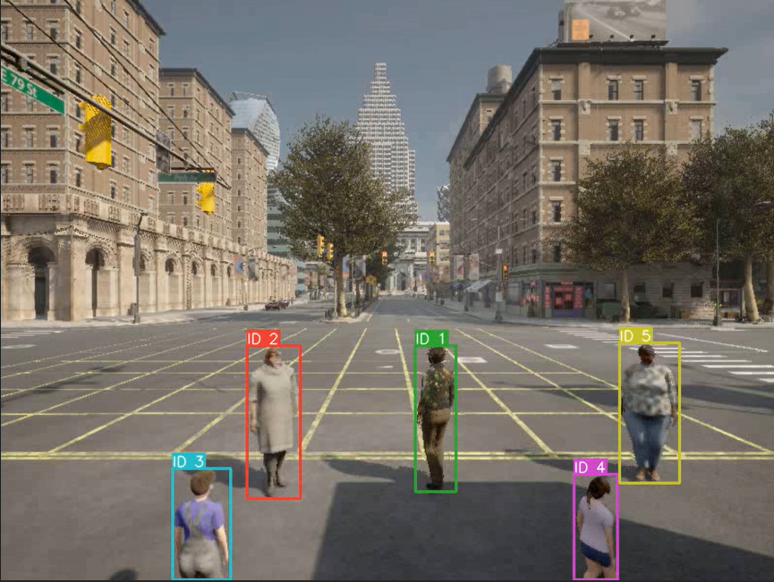
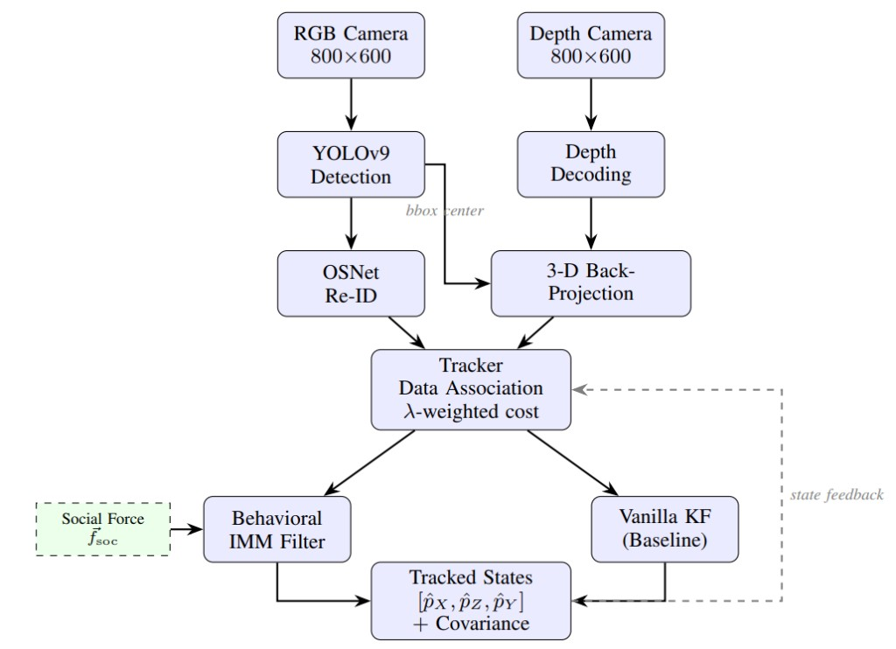

# MAVBE — Multi-Agent Vehicle Behavior Estimator

A behavior-aware multi-pedestrian tracking system evaluated in CARLA simulation. Compares a **Behavioral IMM filter** (Interacting Multiple Model with social force augmentation) against a **Vanilla Kalman Filter** baseline across varying pedestrian densities and appearance-motion cost weightings.

<p align="center">
  
</p>

---

## Pipeline

<p align="center">
  
</p>

| Stage | Description |
|-------|-------------|
| **RGB + Depth capture** | Forward-facing 800x600 camera in CARLA (90° FOV, 20 Hz) |
| **YOLOv9 detection** | Person-class bounding boxes with configurable confidence threshold |
| **OSNet Re-ID** | Appearance feature extraction for each detection |
| **3-D back-projection** | Depth lookup + pixel unprojection to camera-frame coordinates |
| **Data association** | DeepSORT cascade matching with λ-weighted appearance + motion cost |
| **State estimation** | Behavioral IMM (CV/CT/CA + social force) *or* Vanilla KF baseline |
| **Output** | Per-track 3-D positions `[pX, pZ, pY]` + covariance |

---

## Repository Structure

```
MAVBE/
├── experiment_pipeline/          # End-to-end experiment orchestration
│   ├── config.py                 #   All tuneable parameters
│   ├── carla_scenario.py         #   CARLA recording: spawn ego + peds, capture video/depth/GT
│   ├── run_tracking.py           #   YOLO + DeepSORT tracking with IMM or KF
│   ├── evaluate.py               #   Hungarian track-to-GT matching, RMSE, IDSW, trajectory plots
│   ├── plot_summary.py           #   Aggregate RMSE & IDSW vs. #pedestrians plots
│   └── run_experiments.py        #   Main entry point — runs all four phases
├── perception/
│   ├── deep_sort/                #   DeepSORT tracker (Behavioral IMM + Vanilla KF variants)
│   ├── yolov9/                   #   YOLOv9 detection model
│   ├── detect_dual_tracking.py   #   Standalone YOLO+DeepSORT (IMM) on any video
│   └── detect_dual_tracking_kf.py#   Standalone YOLO+DeepSORT (Vanilla KF) on any video
├── carla_integration/            # CARLA scenario scripts (pedestrian crossing, multi-ped, etc.)
├── evaluation/                   # MOT-style metrics (MOTA, MOTP, IDF1)
├── configs/                      # YAML configs for DeepSORT
├── report/                       # LaTeX scientific paper (main.tex + references.bib)
├── assets/                       # Images for README
├── .gitignore
└── requirements.txt
```

> **Note:** Model weights (`.pt`), videos (`.mp4`), and experiment results are excluded from version control via `.gitignore`. Run the pipeline to regenerate them.

---

## Setup

### Prerequisites

- **CARLA 0.9.15+** running on `localhost:2000`
- **Python 3.8+**
- **CUDA-capable GPU** (recommended)

### Install

```bash
git clone https://github.com/<your-org>/MAVBE.git
cd MAVBE
pip install -r requirements.txt
```

YOLOv9 weights (`yolov9-c.pt`) are auto-downloaded on first run, or place them manually in the repo root.

---

## Quick Start

### 1. Run the full experiment pipeline

Start CARLA, then:

```bash
cd experiment_pipeline
python run_experiments.py --trials 5 --device cuda:0 --save_video
```

This executes four phases in sequence:

| Phase | What happens | CARLA needed? |
|-------|-------------|:-------------:|
| **1 — Record** | Spawns ego + pedestrians, captures RGB video, depth frames, and ground truth | Yes |
| **2 — Track** | Runs YOLOv9 + DeepSORT with each filter/λ configuration | No |
| **3 — Evaluate** | Computes RMSE, IDSW, and trajectory plots per method | No |
| **4 — Summarize** | Generates aggregate RMSE & IDSW vs. #pedestrians plots | No |

CARLA can be shut down after Phase 1 completes.

### 2. Record CARLA videos only (no tracking)

```bash
python run_experiments.py --trials 5 --only_carla
```

### 3. Rerun tracking on existing recordings

```bash
python run_experiments.py --skip_carla --results_dir results/run_20260316_070259 --device cuda:0
```

### 4. Regenerate plots from existing metrics

```bash
python run_experiments.py --only_plots --results_dir results/run_20260316_070259
```

### 5. Test a single 5-pedestrian scenario

```bash
cd experiment_pipeline
python carla_scenario.py --n_peds 5 --output_dir test_run
python run_tracking.py --source test_run/video.mp4 --depth_dir test_run/depth_frames --filter imm --lambda_ 0.5 --output_dir test_run/imm_l05 --save_video
python evaluate.py --gt test_run/gt_world.csv --pred test_run/imm_l05/tracks_world.csv --output_dir test_run/imm_l05
```

---

## Standalone Scripts

These can be used independently of the experiment pipeline:

| Script | Description |
|--------|-------------|
| `perception/detect_dual_tracking.py` | Run YOLOv9 + DeepSORT (Behavioral IMM) on any video file |
| `perception/detect_dual_tracking_kf.py` | Same as above but with Vanilla KF |
| `carla_integration/scenario_pedestrian_crossing.py` | Single-pedestrian crossing scenario in CARLA |
| `carla_integration/scenario_pedestrian_crossing_multi.py` | Multi-pedestrian scenario with filter-based braking |
| `carla_integration/spawn_pedestrian_video.py` | Spawn vehicle + pedestrian every 10s, record 60s video |
| `carla_integration/spawn_pred_crossing_with_Depth.py` | Pedestrian crossing with RGB-D capture |

---

## Method Configurations

The experiment sweeps over **5 methods** × **1–5 pedestrians** × *N* trials:

| ID | Method | Filter | λ | Description |
|----|--------|--------|---|-------------|
| M1 | `imm_l0` | Behavioral IMM | 0.0 | Motion-only association, behavior-aware state estimation |
| M2 | `imm_l05` | Behavioral IMM | 0.5 | Balanced appearance + motion cost with IMM |
| M3 | `kf_l0` | Vanilla KF | 0.0 | Motion-only association, constant-velocity baseline |
| M4 | `kf_l05` | Vanilla KF | 0.5 | Balanced appearance + motion cost with KF |
| M5 | `kf_l1` | Vanilla KF | 1.0 | Pure appearance association, KF state propagation |

The λ parameter controls the cost blend in DeepSORT: `cost = λ · d_appearance + (1 − λ) · d_motion`.

---

## Configuration

All parameters live in `experiment_pipeline/config.py`:

| Parameter | Default | Purpose |
|-----------|---------|---------|
| `PED_COUNTS` | `[1, 2, 3, 4, 5]` | Pedestrian count sweep |
| `N_TRIALS` | `1` | Trials per configuration (override with `--trials`) |
| `SPAWN_MU` | `(6, 0, 0)` m | Mean spawn offset from ego (forward, lateral, vertical) |
| `SPAWN_SIGMA` | `(1, 3, 0)` m | Spawn spread std-dev per axis |
| `SIM_DURATION` | `5.0` s | Recording length per scenario |
| `FPS` | `20` | Capture frame rate |
| `CONF_THRESH` | `0.8` | YOLO detection confidence threshold |
| `SOCIAL_FORCE_RADIUS` | `2.0` m | Pedestrian repulsion interaction distance |

---

## Outputs

Each run produces a timestamped results directory:

```
results/run_20260316_070259/
├── trial_0/
│   ├── n1/                    # 1-pedestrian scenario
│   │   ├── video.mp4          # Raw CARLA recording
│   │   ├── depth_frames/      # 16-bit PNG depth maps
│   │   ├── gt_world.csv       # Ground truth (camera-frame 3-D)
│   │   ├── imm_l0/            # Method results
│   │   │   ├── tracks_world.csv
│   │   │   ├── metrics.json   # {total_rmse, id_switches, ...}
│   │   │   ├── trajectories.png
│   │   │   └── tracking_output.mp4  (if --save_video)
│   │   ├── imm_l05/
│   │   ├── kf_l0/
│   │   ├── kf_l05/
│   │   └── kf_l1/
│   ├── n2/ ...
│   └── n5/
├── trial_1/ ...
├── rmse_vs_npeds.png          # Summary plot
└── idsw_vs_npeds.png          # Summary plot
```

---

## Evaluation Metrics

- **RMSE** — Root-mean-square 3-D position error (metres) between predicted and ground-truth tracks, matched via the Hungarian algorithm on pairwise RMSE cost
- **IDSW** — Identity switches: excess tracks beyond GT count + per-frame reassignments where the nearest predicted track changes identity

---

## CLI Reference

```
python run_experiments.py [OPTIONS]

Options:
  --results_dir DIR    Output directory (auto-timestamped by default)
  --trials N           Number of trials per config (default: 1)
  --skip_carla         Reuse existing CARLA recordings
  --skip_tracking      Reuse existing tracking outputs
  --only_carla         Stop after CARLA recording (Phase 1)
  --only_plots         Only regenerate summary plots
  --device DEVICE      Torch device, e.g. cuda:0 (default: cpu)
  --weights PATH       Path to YOLO weights file
  --save_video         Save annotated tracking video per method
  --host HOST          CARLA server host (default: 127.0.0.1)
  --port PORT          CARLA server port (default: 2000)
```
